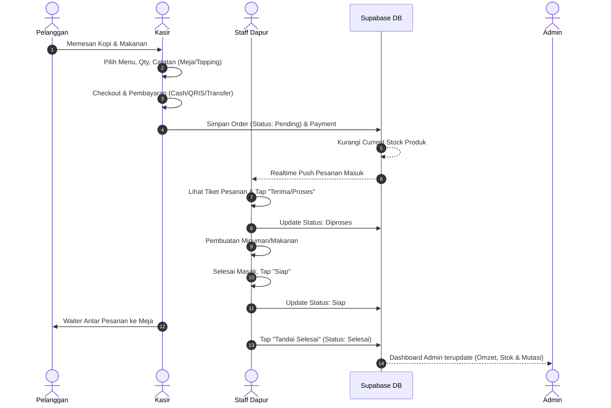
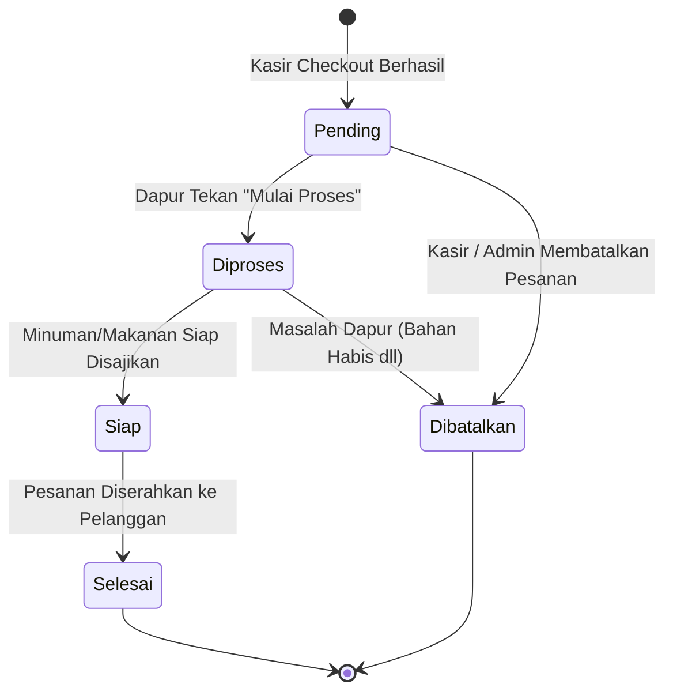

# 📋 PRODUCT REQUIREMENT DOCUMENT (PRD)
## Vstock Cafe Edition — Smart POS & Kitchen Display System (KDS)
**Versi:** 1.0.0 (MVP)  
**Status:** Approved Blueprint Specification  
**Tema Desain:** Warm Coffee Brown Palette (Espresso, Crema, Oat, Caramel)

---

## 1. Executive Summary & Visi Produk
**Vstock Cafe Edition** adalah sistem Point of Sale (POS) dan Kitchen Management terintegrasi khusus operasional kafe/coffee shop. Sistem ini menjembatani interaksi tiga pilar operasional:
1. **Front-of-House (Kasir)**: Input pesanan cepat dengan preferensi khusus (less sugar, extra shot, dine-in/takeaway), checkout multi-metode pembayaran.
2. **Back-of-House (Dapur/Barista)**: Penerimaan pesanan tiket digital real-time (KDS), pengubahan status pembuatan pesanan tanpa kertas struk hilang.
3. **Management (Admin)**: Kontrol stok otomatis per transaksi, kontrol katalog & harga, serta analitik omzet dan pergerakan stok.

---

## 2. User Roles & Matriks Hak Akses

| Fitur / Modul | Admin | Kasir | Staff Dapur |
|---|:---:|:---:|:---:|
| **Dashboard Metrik & Omzet** | ✅ Full Access | ❌ | ❌ |
| **Kelola Produk, Kategori & Harga** | ✅ Full Access | ❌ (Hanya lihat katalog) | ❌ |
| **Kelola Stok & Mutasi Masuk** | ✅ Full Access | ❌ (Hanya lihat sisa) | ❌ |
| **Kelola User & Role** | ✅ Full Access | ❌ | ❌ |
| **POS & Buat Pesanan Baru** | ✅ | ✅ Full Access | ❌ |
| **Checkout & Pembayaran (Cash, QRIS, Transfer)** | ✅ | ✅ Full Access | ❌ |
| **Cetak & Tampilkan Struk** | ✅ | ✅ Full Access | ❌ |
| **Kitchen Display (Lihat Antrean Dapur)** | ✅ (Monitor) | ❌ | ✅ Full Access |
| **Update Status Masak (Pending → Siap)** | ✅ | ❌ | ✅ Full Access |
| **Laporan Penjualan & Laporan Stok** | ✅ Full Access | ❌ | ❌ |

---

## 3. Fitur Utama & Kebutuhan Fungsional (Per Role)

### 3.1. Role Admin
1. **Autentikasi**:
   - Login menggunakan email/username & PIN/password.
   - Logout & sesi aman.
2. **Dashboard**:
   - Metrik ringkasan: Total Omzet Hari Ini, Jumlah Transaksi, Total Produk Aktif, Alert Stok Menipis.
   - Grafik penjualan singkat (7 hari terakhir).
3. **Kelola Produk & Kategori**:
   - CRUD Produk: Nama menu, kategori, foto, SKU/Barcode, harga jual, estimasi HPP, status ketersediaan (*In Stock / Sold Out*).
   - CRUD Kategori: Coffee, Non-Coffee, Pastry, Heavy Meals, Additional/Topping.
4. **Kelola Harga & Varian**:
   - Update harga jual langsung dengan rekam jejak.
5. **Kelola Stok**:
   - Monitoring sisa stok (porsi menu / bahan dasar kemasan).
   - Penambahan stok (Restock Masuk), penyesuaian (Adjustment/Waste).
6. **Kelola User & Role**:
   - Tambah, ubah, nonaktifkan akun Kasir dan Staff Dapur beserta hak aksesnya.
7. **Riwayat Transaksi**:
   - Log seluruh transaksi lampau dengan filter tanggal, status, dan kasir bertugas.
8. **Laporan**:
   - **Laporan Penjualan**: Filter per rentang tanggal, breakdown per metode pembayaran (Cash, QRIS, Transfer), menu terlaris (*best seller*).
   - **Laporan Stok**: Riwayat pergerakan stok masuk dan keluar (*Stock Movement Log*).

---

### 3.2. Role Kasir
1. **Autentikasi**:
   - Login cepat via PIN Kasir / Akun Kasir.
   - Pergantian kasir & Logout.
2. **Dashboard Kasir / POS Screen**:
   - Grid menu katalog dengan filter kategori instan (*Pills button*).
   - Pencarian cepat (*Search bar*) dan indikator stok live (*Sold out badges*).
3. **Manajemen Keranjang & Pesanan**:
   - Tap menu untuk menambah ke keranjang.
   - Mengatur kuantitas (+ / -).
   - **Catatan Pesanan (*Order Notes*)**: Tambah opsi per item (cth: *"Less sugar"*, *"Oatmilk"*, *"Extra ice"*) atau catatan global (cth: *"Meja 04 - Dine In"*).
4. **Checkout & Pembayaran**:
   - Rincian Subtotal, Pajak/Service (jika ada), Diskon, dan Total Bayar.
   - Pilihan Metode Pembayaran:
     - **Cash**: Pilihan nominal cepat (Uang pas, Rp50.000, Rp100.000) & hitung kembalian otomatis.
     - **QRIS**: Tampilkan kode QR dinamis/statis & konfirmasi sukses.
     - **Transfer Bank**: Pilihan akun bank tujuan & nomor referensi transfer.
5. **Penyelesaian & Struk**:
   - Tombol cetak struk via printer thermal Bluetooth (58mm/80mm) atau tampilkan struk digital.
   - Otomatis men-trigger pesanan masuk ke antrean Kitchen Display System (Dapur).
6. **Riwayat Transaksi Kasir**:
   - Melihat transaksi yang dibuat oleh kasir yang sedang bertugas hari ini.

---

### 3.3. Role Staff Dapur (Kitchen Display System)
1. **Autentikasi**:
   - Login Staff Dapur (kredensial khusus stasiun dapur/bar).
2. **Kitchen Dashboard (KDS)**:
   - Tampilan tiket pesanan model *Kanban / Card List* vertikal yang rapi.
   - Pemisahan tab: **Pesanan Baru (Pending)** | **Sedang Diproses** | **Siap Saji**.
   - Indikator waktu tunggu (*Elapsed timer*: cth. "04:15 mnt lalu" dengan *color alert* jika lebih dari 15 menit).
3. **Melihat Detail Pesanan**:
   - Nomor Invoice / Nomor Antrean (cth: `#COF-102`).
   - Nomor Meja / Tipe (Dine In / Takeaway).
   - Daftar item, porsi kuantitas, dan catatan khusus yang ditonjolkan (tebal & berlatar kontras).
4. **Aksi Status Pesanan**:
   - **Terima / Proses**: Mengubah status dari `Pending` ke `Diproses`.
   - **Siap Saji**: Mengubah status dari `Diproses` ke `Siap` (Memberi sinyal ke kasir/waiter bahwa pesanan siap diantar).
   - **Tandai Selesai**: Pesanan diantar dan ditutup (`Selesai`).

---

## 4. Alur Utama Sistem (End-to-End Workflow)



### 4.1. Alur Transaksi & Stok
1. **Kasir**: Login → Pilih Produk → Keranjang → Checkout → Pembayaran → Transaksi Berhasil → Pesanan Masuk Dapur.
2. **Dapur**: Pesanan Baru (`Pending`) → Diterima/Dimasak (`Diproses`) → Matang (`Siap`) → Diantar (`Selesai`).
3. **Stok**: Transaksi Berhasil → Stok Produk otomatis terpotong pada tabel `stock_movements` → Admin memantau sisa stok di Dashboard Admin → Admin melakukan penambahan stok jika sisa stok menyentuh batas minimum (*min_stock*).

---

## 5. State Machine & Siklus Status Pesanan



*   **Pending**: Pesanan baru dibayar kasir, menunggu staf dapur membuka/mengambil tiket.
*   **Diproses**: Barista / Koki sedang meracik pesanan.
*   **Siap**: Makanan/minuman sudah diletakkan di *pickup counter* atau siap diantar ke meja.
*   **Selesai**: Pelanggan sudah menerima pesanan secara lengkap.
*   **Dibatalkan**: Pesanan dibatalkan (memerlukan alasan pembatalan & pengembalian stok jika sudah terpotong).

---

## 6. Arsitektur Database (Supabase PostgreSQL)

Sesuai blueprint, database menggunakan 8 tabel inti dengan skema relasional yang ketat:

### 6.1. `profiles`
Menyimpan identitas pengguna dan peran akses sistem.
```sql
CREATE TABLE profiles (
    id UUID PRIMARY KEY REFERENCES auth.users(id) ON DELETE CASCADE,
    full_name VARCHAR(100) NOT NULL,
    role VARCHAR(20) NOT NULL CHECK (role IN ('admin', 'kasir', 'dapur')),
    avatar_url TEXT,
    phone VARCHAR(20),
    is_active BOOLEAN DEFAULT TRUE,
    created_at TIMESTAMPTZ DEFAULT NOW(),
    updated_at TIMESTAMPTZ DEFAULT NOW()
);
```

### 6.2. `categories`
Kategori pengelompokan menu kafe.
```sql
CREATE TABLE categories (
    id UUID PRIMARY KEY DEFAULT gen_random_uuid(),
    name VARCHAR(50) NOT NULL,
    icon_name VARCHAR(50),
    sort_order INT DEFAULT 0,
    created_at TIMESTAMPTZ DEFAULT NOW()
);
```

### 6.3. `products`
Daftar menu minuman, makanan, dan produk kafe.
```sql
CREATE TABLE products (
    id UUID PRIMARY KEY DEFAULT gen_random_uuid(),
    category_id UUID REFERENCES categories(id) ON DELETE SET NULL,
    name VARCHAR(100) NOT NULL,
    barcode VARCHAR(50),
    description TEXT,
    purchase_price NUMERIC(12, 2) DEFAULT 0.00, -- HPP modal
    selling_price NUMERIC(12, 2) NOT NULL,     -- Harga Jual
    current_stock INT NOT NULL DEFAULT 0,
    min_stock INT DEFAULT 5,
    unit VARCHAR(20) DEFAULT 'cup',             -- cup, portion, pcs
    image_url TEXT,
    is_active BOOLEAN DEFAULT TRUE,
    created_at TIMESTAMPTZ DEFAULT NOW(),
    updated_at TIMESTAMPTZ DEFAULT NOW()
);
```

### 6.4. `orders`
Induk transaksi pesanan kafe.
```sql
CREATE TABLE orders (
    id UUID PRIMARY KEY DEFAULT gen_random_uuid(),
    order_number VARCHAR(30) UNIQUE NOT NULL,  -- cth: ORD-20261008-001
    table_number VARCHAR(20),                   -- cth: "Meja 03", "Takeaway"
    order_type VARCHAR(20) NOT NULL DEFAULT 'dine_in' CHECK (order_type IN ('dine_in', 'takeaway', 'delivery')),
    cashier_id UUID REFERENCES profiles(id),
    customer_name VARCHAR(100),
    subtotal NUMERIC(12, 2) NOT NULL DEFAULT 0.00,
    discount NUMERIC(12, 2) DEFAULT 0.00,
    tax NUMERIC(12, 2) DEFAULT 0.00,
    total_amount NUMERIC(12, 2) NOT NULL,
    status VARCHAR(20) NOT NULL DEFAULT 'pending' CHECK (status IN ('pending', 'diproses', 'siap', 'selesai', 'dibatalkan')),
    notes TEXT,
    created_at TIMESTAMPTZ DEFAULT NOW(),
    updated_at TIMESTAMPTZ DEFAULT NOW()
);
```

### 6.5. `order_items`
Rincian menu yang dipesan dalam satu order.
```sql
CREATE TABLE order_items (
    id UUID PRIMARY KEY DEFAULT gen_random_uuid(),
    order_id UUID NOT NULL REFERENCES orders(id) ON DELETE CASCADE,
    product_id UUID NOT NULL REFERENCES products(id),
    quantity INT NOT NULL CHECK (quantity > 0),
    unit_price NUMERIC(12, 2) NOT NULL,
    subtotal NUMERIC(12, 2) NOT NULL,
    item_notes TEXT,                           -- cth: "Less ice, Less sugar 50%"
    status VARCHAR(20) DEFAULT 'pending' CHECK (status IN ('pending', 'diproses', 'siap')),
    created_at TIMESTAMPTZ DEFAULT NOW()
);
```

### 6.6. `payments`
Rekam jejak pembayaran transaksi.
```sql
CREATE TABLE payments (
    id UUID PRIMARY KEY DEFAULT gen_random_uuid(),
    order_id UUID NOT NULL REFERENCES orders(id) ON DELETE CASCADE,
    payment_method VARCHAR(20) NOT NULL CHECK (payment_method IN ('cash', 'qris', 'transfer')),
    amount_paid NUMERIC(12, 2) NOT NULL,
    change_amount NUMERIC(12, 2) DEFAULT 0.00,
    payment_status VARCHAR(20) DEFAULT 'paid' CHECK (payment_status IN ('pending', 'paid', 'failed')),
    reference_id VARCHAR(100),                  -- ID transaksi QRIS / Ref Bank
    created_at TIMESTAMPTZ DEFAULT NOW()
);
```

### 6.7. `stock_movements`
Audit log mutasi penambahan atau pengurangan stok produk.
```sql
CREATE TABLE stock_movements (
    id UUID PRIMARY KEY DEFAULT gen_random_uuid(),
    product_id UUID NOT NULL REFERENCES products(id) ON DELETE CASCADE,
    type VARCHAR(20) NOT NULL CHECK (type IN ('sale', 'restock', 'adjustment', 'waste')),
    quantity INT NOT NULL,                     -- Nilai perubahan (- / +)
    stock_before INT NOT NULL,
    stock_after INT NOT NULL,
    reference_id UUID,                         -- ID Order (jika sale)
    notes TEXT,
    created_at TIMESTAMPTZ DEFAULT NOW()
);
```

### 6.8. `order_status_logs`
Histori perubahan status pesanan untuk audit durasi masak dapur.
```sql
CREATE TABLE order_status_logs (
    id UUID PRIMARY KEY DEFAULT gen_random_uuid(),
    order_id UUID NOT NULL REFERENCES orders(id) ON DELETE CASCADE,
    previous_status VARCHAR(20),
    new_status VARCHAR(20) NOT NULL,
    changed_by UUID REFERENCES profiles(id),
    notes TEXT,
    created_at TIMESTAMPTZ DEFAULT NOW()
);
```

---

## 7. Design System & Skema Warna Warm Brown

```
Palet Warna Cafe / Coffee Theme:
┌─────────────────────────┬──────────────┬─────────────────────────────────────┐
│ Nama Token               │ Hex Code     │ Penggunaan                          │
├─────────────────────────┼──────────────┼─────────────────────────────────────┤
│ Espresso Dark (Primary) │ #3A2312      │ Header, Text Utama, Active States   │
│ Warm Mocha (Secondary)  │ #6F4E37      │ Subhead, Border, Accent Button      │
│ Caramel Crema (Accent)  │ #C68B59      │ Tombol Utama (CTA), Badges, Qty     │
│ Latte Cream (Surface)   │ #F7F2EC      │ Background Halaman Utama            │
│ Milk Foam White (Card)  │ #FFFFFF      │ Card Container, Modal Popup         │
│ Roasted Amber (Pending) │ #D97706      │ Status Tiket: Pending               │
│ Bronze Brew (Diproses)  │ #8C4A26      │ Status Tiket: Sedang Diproses       │
│ Matcha Mint (Siap)      │ #2E7D32      │ Status Tiket: Siap Saji / Selesai   │
│ Rust Terracotta (Batal) │ #C62828      │ Status: Dibatalkan / Alert Stok     │
└─────────────────────────┴──────────────┴─────────────────────────────────────┘
```

---

## 8. WIREFRAME MOBILE SPESIFIKASI


Berikut rancangan layout antarmuka mobile (viewport smartphone 390x844 dp) untuk 3 role utama:

### 8.1. Wireframe Mobile: ADMIN PAGE
Layar kendali manajerial dengan ringkasan omzet, status stok menipis, dan navigasi cepat.

```
┌──────────────────────────────────────────┐
│ [≡]  VSTOCK CAFE ADMIN           [🔔] [👤]│  <- Header: Espresso (#3A2312)
├──────────────────────────────────────────┤
│ 🌤️ Selamat Datang, Owner                │
│ Kamis, 08 Okt 2026 • Kafe Cabang Utama   │
│                                          │
│ ┌──────────────────────────────────────┐ │
│ │ ☕ Ringkasan Penjualan Hari Ini       │ │  <- Card Brown Gradient
│ │ Rp 3.450.000                         │ │     Nominal Omzet Bersih
│ │ ┌──────────────────┬───────────────┐ │ │
│ │ │ 🛒 84 Transaksi  │ ⚠️ 3 Stok Tipis│ │ │
│ │ └──────────────────┴───────────────┘ │ │
│ └──────────────────────────────────────┘ │
│                                          │
│ 📌 MENU MANAJEMEN                        │
│ ┌──────────────┐ ┌──────────────┐        │
│ │ [📦] Produk  │ │ [🏷️] Kategori│        │  <- Grid Card Putih (#FFFFFF)
│ │ 42 Menu      │ │ 6 Kategori   │        │     Border Halus (#E5D8CC)
│ └──────────────┘ └──────────────┘        │
│ ┌──────────────┐ ┌──────────────┐        │
│ │ [📊] Stok    │ │ [👥] Pengguna│        │
│ │ Audit & In/Out│ │ Kasir & Dapur│       │
│ └──────────────┘ └──────────────┘        │
│ ┌──────────────┐ ┌──────────────┐        │
│ │ [📈] Laporan │ │ [💰] Kelola  │        │
│ │ Penjualan    │ │     Harga    │        │
│ └──────────────┘ └──────────────┘        │
│                                          │
│ ⚠️ PERINGATAN STOK MENIPIS (< Min Stock) │
│ ┌──────────────────────────────────────┐ │
│ │ • Espresso Roast Beans  (Sisa: 2 kg) │ │  <- Alert Box Caramel
│ │ • Susu Fresh Milk 1L    (Sisa: 3 btl)│ │
│ │ • Vanilla Syrup 750ml   (Sisa: 1 btl)│ │
│ │ [+ Tambah Stok Sekarang]             │ │
│ └──────────────────────────────────────┘ │
│                                          │
│ 📋 TRANSAKSI TERAKHIR                    │
│ ┌──────────────────────────────────────┐ │
│ │ #ORD-084 • Meja 02     Rp 75.000     │ │
│ │ 19:35 WIB • 3 Item • Lunas (QRIS)    │ │
│ └──────────────────────────────────────┘ │
├──────────────────────────────────────────┤
│ [🏠 Home]   [📦 Produk]   [📈 Laporan]   │  <- Bottom Navigation Bar
└──────────────────────────────────────────┘
```

---

### 8.2. Wireframe Mobile: KASIR PAGE (POS & CHECKOUT)
Layar POS kasir cepat untuk memilih produk, filter kategori, keranjang belanja, hingga popup pembayaran multi-metode.

#### A. Katalog & Keranjang Kasir
```
┌──────────────────────────────────────────┐
│ [≡]  POS KASIR • SHIFT SORE       [🛒 3] │  <- Header: Espresso (#3A2312)
├──────────────────────────────────────────┤
│ 🔍 [ Cari nama kopi, pastry...       ]   │  <- Search Bar
│                                          │
│ TIPE PESANAN:                            │
│ [ (•) Dine In ]    [ ( ) Takeaway ]      │
│ No. Meja: [ Meja 04 ▾ ]                  │
│                                          │
│ KATEGORI:                                │
│ [ Semua ] [ Coffee* ] [ Non-Coffee ] ... │  <- Pill Filter Horizontal Scroll
│                                          │
│ GRID MENU PRODUK:                        │
│ ┌──────────────┐ ┌──────────────┐        │
│ │ [🖼️ Foto Kopi]│ │ [🖼️ Foto Kopi]│        │  <- Product Card
│ │ Iced Caramel │ │ Hot Americano│        │
│ │ Macchiato    │ │ Rp 22.000    │        │
│ │ Rp 28.000    │ │ Stok: 35 cup │        │
│ │ [+ TAMBAH]   │ │ [+ TAMBAH]   │        │  <- Button Caramel (#C68B59)
│ └──────────────┘ └──────────────┘        │
│ ┌──────────────┐ ┌──────────────┐        │
│ │ [🖼️ Croissant]│ │ [🖼️ Matcha]  │        │
│ │ Butter Pastry│ │ Matcha Latte │        │
│ │ Rp 25.000    │ │ Rp 26.000    │        │
│ │ [SOLD OUT]   │ │ [+ TAMBAH]   │        │
│ └──────────────┘ └──────────────┘        │
├──────────────────────────────────────────┤
│ 🛒 KERANJANG (3 Item)      Total: Rp76.000│  <- Sticky Floating Bar
│ [ LIHAT PESANAN & CHECKOUT > ]           │  <- Tombol Crema Brown
└──────────────────────────────────────────┘
```

#### B. Modal Checkout & Pembayaran Kasir
```
┌──────────────────────────────────────────┐
│ 🧾 DETAIL PESANAN & CHECKOUT         [✕] │
├──────────────────────────────────────────┤
│ Pesanan: Meja 04 • Pelanggan: Dimas      │
│                                          │
│ 1x Iced Caramel Macchiato     Rp 28.000  │
│    └ 📝 "Less sugar 50%, extra ice"      │
│    [ - ] [ 1 ] [ + ]                     │
│                                          │
│ 2x Matcha Latte               Rp 48.000  │
│    └ 📝 "Hot, Oatmilk"                   │
│    [ - ] [ 2 ] [ + ]                     │
│ ──────────────────────────────────────── │
│ Subtotal                      Rp 76.000  │
│ Pajak PB1 (10%)               Rp  7.600  │
│ TOTAL BAYAR                   Rp 83.600  │
│                                          │
│ PILIH METODE PEMBAYARAN:                 │
│ ┌────────────┐ ┌────────────┐ ┌────────┐ │
│ │ [💵] CASH* │ │ [📱] QRIS  │ │[🏦] TF │ │  <- Tabs Pembayaran
│ └────────────┘ └────────────┘ └────────┘ │
│                                          │
│ Nominal Uang Diterima:                   │
│ [ Rp 100.000                            ]│
│ [ Uang Pas ] [ Rp 90.000 ] [ Rp 100.000] │  <- Quick Cash Buttons
│ Kembalian: Rp 16.400                     │
│                                          │
│ [🖨️ CETAK STRUK & PROSES KE DAPUR]       │  <- Main CTA Button (#3A2312)
└──────────────────────────────────────────┘
```

---

### 8.3. Wireframe Mobile: DAPUR PAGE (KITCHEN DISPLAY SYSTEM / KDS)
Layar monitor stasiun barista & dapur untuk menerima antrean, membaca detail catatan pesanan, dan menggeser status secara real-time.

```
┌──────────────────────────────────────────┐
│ 🍳 KITCHEN DISPLAY • BAR & DAPUR   [🔔 4]│  <- Header: Espresso (#3A2312)
├──────────────────────────────────────────┤
│ TAB STATUS:                              │
│ [ BARU (2)* ]   [ PROSES (1) ]  [ SIAP(1)│  <- Status Badges
│                                          │
│ ┌──────────────────────────────────────┐ │
│ │ TIKET #ORD-085          ⏱️ 02:40 mnt │ │  <- Card: Amber Border (Pending)
│ │ 📍 MEJA 04 • DINE IN                 │ │
│ │ ──────────────────────────────────── │ │
│ │ • 1x Iced Caramel Macchiato          │ │
│ │   ⚠️ CATATAN: Less sugar, Extra ice  │ │  <- Highlighted Order Notes
│ │ • 2x Matcha Latte (Hot, Oatmilk)     │ │
│ │ ──────────────────────────────────── │ │
│ │ [ 👨‍🍳 TERIMA & MULAI PROSES ]         │ │  <- Action: Pending -> Diproses
│ └──────────────────────────────────────┘ │
│                                          │
│ ┌──────────────────────────────────────┐ │
│ │ TIKET #ORD-084          ⏱️ 08:15 mnt │ │  <- Card: Bronze (Sedang Diproses)
│ │ 📍 TAKEAWAY #012                     │ │
│ │ ──────────────────────────────────── │ │
│ │ • 1x Espresso Double Shot            │ │
│ │ • 1x Almond Croissant (Warm)         │ │
│ │ ──────────────────────────────────── │ │
│ │ [ ✅ PESANAN SIAP SAJI ]              │ │  <- Action: Diproses -> Siap
│ └──────────────────────────────────────┘ │
│                                          │
│ ┌──────────────────────────────────────┐ │
│ │ TIKET #ORD-083          ⏱️ 14:20 mnt │ │  <- Card: Green Tint (Siap Saji)
│ │ 📍 MEJA 01 • DINE IN                 │ │
│ │ • 2x V60 Gayo Wine                   │ │
│ │ [ ✔️ TANDAI SELESAI / DISAJIKAN ]    │ │  <- Action: Siap -> Selesai
│ └──────────────────────────────────────┘ │
├──────────────────────────────────────────┤
│ Status Terhubung: 🟢 Supabase Realtime  │
└──────────────────────────────────────────┘
```

---

## 9. Ruang Lingkup MVP (Minimum Viable Product)

Implementasi tahap pertama difokuskan pada rantai nilai kritis (*Core Value Loop*):
1. **Produk & Kategori**: Admin menambahkan menu kafe beserta harga jual dan stok awal.
2. **Stok Dasar**: Sistem melacak sisa kuantitas per produk dan menolak order bila stok habis.
3. **POS Kasir**: Kasir memilih menu, menginput catatan pesanan khusus, dan memilih tipe meja.
4. **Pembayaran**: Kasir menerima pembayaran (Cash dengan perhitungan kembalian, QRIS, Transfer).
5. **Pesanan Dapur**: Order otomatis muncul di Kitchen Display System secara instan via Supabase Realtime channel.
6. **Status Pesanan**: Staff Dapur menggeser status (`Pending` → `Diproses` → `Siap` → `Selesai`).
7. **Laporan Penjualan**: Admin dapat melihat ringkasan omzet harian dan produk terlaris.

---
*Dokumen ini dibuat mengacu langsung pada Blueprint POS Cafe Vstock dan aturan arsitektur data sistem.*
